# Dash 冲刺功能实现指南

> 适用项目：UOP1 / Chop Chop
> Unity 版本：`2022.3.62f3c1`
> 输入系统：Unity Input System `1.14.0`
> 角色移动方式：ScriptableObject 状态机 + `CharacterController`
> 文档目标：在尊重现有架构的前提下，自己完成一个可调试、可扩展的地面 Dash。
> 当前状态：这是实现指南，不代表功能已经写入项目。

---

## 目录

1. [先确定第一版 Dash 的规则](#1-先确定第一版-dash-的规则)
2. [理解现有输入与移动链路](#2-理解现有输入与移动链路)
3. [本次预计新增和修改的内容](#3-本次预计新增和修改的内容)
4. [步骤一：在 Input Actions 中添加 Dash](#4-步骤一在-input-actions-中添加-dash)
5. [步骤二：让 InputReader 广播 Dash 事件](#5-步骤二让-inputreader-广播-dash-事件)
6. [步骤三：让 Protagonist 缓存 Dash 请求](#6-步骤三让-protagonist-缓存-dash-请求)
7. [步骤四：创建 Dash 输入条件](#7-步骤四创建-dash-输入条件)
8. [步骤五：创建 DashMovement Action](#8-步骤五创建-dashmovement-action)
9. [步骤六：创建并组装 Dash 状态资产](#9-步骤六创建并组装-dash-状态资产)
10. [步骤七：配置状态转换](#10-步骤七配置状态转换)
11. [步骤八：分阶段验证](#11-步骤八分阶段验证)
12. [常见问题与排查方法](#12-常见问题与排查方法)
13. [完成基础版之后的扩展方向](#13-完成基础版之后的扩展方向)
14. [最终检查清单](#14-最终检查清单)

---

## 1. 先确定第一版 Dash 的规则

Dash 的代码并不难，真正需要先想清楚的是“它应该有什么手感”。规则没有确定时，很容易一边写一边改架构。

建议第一版采用下面这组规则：

| 问题 | 第一版推荐答案 | 原因 |
|------|----------------|------|
| 在哪里能 Dash | 只允许 `Idle` 和 `Walking` | 先避开空中重力和滑坡状态的复杂组合 |
| 如何触发 | 按一下触发一次 | Dash 是离散动作，不是持续移动 |
| 有移动输入时的方向 | 当前移动输入方向 | 符合玩家直觉 |
| 无移动输入时的方向 | 角色当前面向方向 | 允许原地向前冲刺 |
| Dash 中能否转向 | 不能，进入状态时锁定方向 | 行为清晰，也方便调试 |
| Dash 速度 | 先尝试 `16～20` | 当前地面移动速度是 `8`，Dash 应明显更快 |
| Dash 持续时间 | 先尝试 `0.15～0.25` 秒 | 速度 `18`、时间 `0.2` 时，理论距离约 `3.6` 米 |
| 是否有冷却 | 第一版暂时没有 | 先确认核心链路正确，再增加限制 |
| 是否有无敌帧 | 第一版没有 | 无敌属于战斗规则，不应和基础移动同时开发 |
| 是否保留结束惯性 | 第一版不保留 | Dash 结束后回到普通移动，最容易验证 |

### 1.1 为什么先做“地面 Dash”

地面状态已经具备：

- `GroundGravityAction`：给角色持续的向下速度，让角色贴地。
- `ApplyMovementVectorAction`：统一调用 `CharacterController.Move()`。
- `Idle`、`Walking`：两个明确且稳定的进入来源。
- `IsMovingCondition`：Dash 结束后可以据此决定回到 Idle 还是 Walking。

如果一开始就支持空中 Dash，还需要同时定义：

- Dash 是否清空垂直速度。
- Dash 后继续上升还是开始下落。
- 一次跳跃能 Dash 几次。
- 落地是否恢复次数。
- 空中按键是否缓存。

这些适合放在第二阶段。

### 1.2 开始前先回答的设计题

在真正写代码前，可以先把自己的答案写在这里：

```text
Dash 速度：____________
Dash 持续时间：____________
无输入时是否允许 Dash：____________
Dash 时能否改变方向：____________
撞墙后是否立刻结束：____________
是否允许连续 Dash：____________
```

---

## 2. 理解现有输入与移动链路

当前项目没有让 `Protagonist` 直接调用 `Keyboard.current`，也没有在角色脚本中直接完成所有移动。它把输入、状态判断和实际移动拆开了。

```mermaid
flowchart LR
    A[玩家按下 Dash 键] --> B[GameInput.inputactions]
    B --> C[自动生成 GameInput.cs]
    C --> D[InputReader.OnDash]
    D --> E[InputReader.DashEvent]
    E --> F[Protagonist 缓存 dashInput]
    F --> G[Dash Condition 判断请求]
    G --> H[状态机进入 Dash State]
    H --> I[DashMovementAction 修改 movementVector]
    I --> J[ApplyMovementVectorAction]
    J --> K[CharacterController.Move]
```



### 2.1 最值得先读的文件

建议依次阅读：

1. `Assets/Settings/Input/GameInput.inputactions`
2. `Assets/Scripts/Input/InputReader.cs`
3. `Assets/Scripts/Characters/Protagonist.cs`
4. `Assets/Scripts/Characters/StateMachine/Actions/HorizontalMoveActionSO.cs`
5. `Assets/Scripts/Characters/StateMachine/Actions/GroundGravityActionSO.cs`
6. `Assets/Scripts/Characters/StateMachine/Actions/ApplyMovementVectorActionSO.cs`
7. `Assets/Scripts/Characters/StateMachine/Conditions/IsMovingConditionSO.cs`
8. `Assets/Scripts/StateMachine/Core/StateMachine.cs`
9. `Assets/Scripts/StateMachine/Core/State.cs`

### 2.2 `movementInput` 与 `movementVector` 的区别

`Protagonist` 中有两个非常容易混淆的字段：

```csharp
public Vector3 movementInput;
public Vector3 movementVector;
```

它们的职责不同：

| 字段 | 含义 | 谁主要修改它 |
|------|------|--------------|
| `movementInput` | 摄像机相对的期望移动方向，并包含输入强度 | `Protagonist.RecalculateMovement()` |
| `movementVector` | 最终将交给 CharacterController 的速度 | 各个 StateAction |

普通地面移动在 `HorizontalMoveAction.OnUpdate()` 中执行：

```csharp
movementVector.x = movementInput.x * speed;
movementVector.z = movementInput.z * speed;
```

真正的移动发生在 `ApplyMovementVectorAction.OnUpdate()`：

```csharp
characterController.Move(movementVector * Time.deltaTime);
```

因此 Dash Action 应该写入“速度”，不要在 Dash Action 里再次乘 `Time.deltaTime`。否则会发生两次时间缩放，Dash 距离会非常短。

### 2.3 Action 的执行顺序很重要

`State.OnUpdate()` 会按照 State 资产中 `_actions` 的数组顺序逐个执行 Action。

因此 Dash 状态应当先计算速度，最后应用移动：

```text
DashMovement
    ↓
GroundGravity
    ↓
ApplyMovementVector
```

如果把 `ApplyMovementVector` 放在 `DashMovement` 前面，本帧应用的是旧速度，看起来就会有一帧延迟。

### 2.4 Transition 的顺序也很重要

`State.TryGetTransition()` 找到第一条满足条件的转换后就会停止检查后面的转换。

这意味着：

- `Idle → Dash` 应具有比普通 `Idle → Walking` 更高的优先级。
- `Walking → Dash` 应具有比普通跳转更高或至少明确的优先级。
- 多条转换同时满足时，排在前面的转换获胜。

---

## 3. 本次预计新增和修改的内容

### 3.1 需要修改的文件

```text
Assets/Settings/Input/GameInput.inputactions
Assets/Scripts/Input/InputReader.cs
Assets/Scripts/Characters/Protagonist.cs
```

可选修改：

```text
Assets/Scripts/Characters/StateMachine/Actions/ClearInputCache_OnEnterSO.cs
```

可选修改用于处理“玩家在空中按 Dash，落地后意外 Dash”的输入残留问题。

### 3.2 需要新增的脚本

```text
Assets/Scripts/Characters/StateMachine/Conditions/HasDashInputConditionSO.cs
Assets/Scripts/Characters/StateMachine/Actions/DashMovementActionSO.cs
```

### 3.3 需要在 Unity 中创建的 ScriptableObject 资产

推荐放到现有主角状态机目录：

```text
Assets/ScriptableObjects/StateMachine/Protagonist/
├── Actions/MovementVector/DashMovement.asset
├── Conditions/HasDashInput.asset
├── Conditions/Timer_Dash.asset
└── States/Dash.asset
```

还要修改：

```text
Assets/ScriptableObjects/StateMachine/Protagonist/PigChef_TransitionTable.asset
```

建议通过 Unity 的 Inspector 和状态机编辑器修改这些 `.asset`，不要手写 YAML。

---

## 4. 步骤一：在 Input Actions 中添加 Dash

### 4.1 本步骤目标

让 Unity Input System 知道项目中存在一个叫 `Dash` 的 Gameplay 动作，并为它配置键盘和手柄按键。

本步骤完成后，自动生成的 `GameInput.IGameplayActions` 接口中应出现 `OnDash(...)`。

### 4.2 Unity 编辑器操作

1. 在 Project 窗口找到：

   `Assets/Settings/Input/GameInput.inputactions`

2. 双击打开 Input Actions 编辑器。
3. 在左侧选择 `Gameplay` Action Map。
4. 点击 Actions 列表中的 `+`。
5. 新 Action 命名为 `Dash`。
6. 设置：

   ```text
   Action Type: Button
   Control Type / Expected Control Type: Button
   ```

7. 给它添加 Binding，第一版建议：

   ```text
   Keyboard: <Keyboard>/leftCtrl
   Gamepad:  <Gamepad>/rightShoulder
   ```

8. 保存 Input Actions 资产。

### 4.3 为什么不复用 Run

项目当前的 `Run` 绑定了 Shift，行为是：

```text
Performed → StartedRunning
Canceled  → StoppedRunning
```

它代表“按住时进入跑步输入状态”。Dash 是“一次按下产生一个脉冲”，生命周期不同。如果复用 Run，后续会很难区分：

- 玩家是在持续跑步。
- 玩家刚刚按下一次 Dash。
- 玩家松开了 Dash 键。

所以应该单独添加 `Dash` Action。

### 4.4 自动生成代码的注意事项

项目已经开启 Generate C# Class：

```text
生成文件：Assets/Scripts/Input/GameInput.cs
```

注意：

- 不要手动编辑 `GameInput.cs`。
- 保存 `.inputactions` 后它会被重新生成。
- 新增 Dash 后，`InputReader` 会暂时因为没有实现 `OnDash` 而编译失败。
- 下一步补上 `OnDash` 后错误应消失。

### 4.5 本步骤验证

可以打开生成的 `GameInput.cs`，只读搜索：

```text
OnDash
Gameplay_Dash
```

如果能找到，说明输入配置和代码生成已完成。

如果找不到：

1. 确认 Action 放在 `Gameplay`，不是 `Menus`。
2. 确认已经保存 Input Actions 窗口。
3. 在 `.inputactions` Inspector 中确认 Generate C# Class 仍然启用。
4. 不要自己在 `GameInput.cs` 中补代码。

---

## 5. 步骤二：让 InputReader 广播 Dash 事件

### 5.1 本步骤目标

把 Input System 的 `OnDash` 回调转换为项目统一使用的 C# 事件。

这样 `Protagonist` 只需要订阅 `InputReader`，不需要知道 Dash 绑定的是键盘 Ctrl 还是手柄肩键。

### 5.2 增加事件声明

打开：

```text
Assets/Scripts/Input/InputReader.cs
```

在 Gameplay 事件区域，参考 `JumpEvent` 和 `AttackEvent`，增加：

```csharp
public event UnityAction DashEvent = delegate { };
```

推荐放在 Jump、Attack、Run 等 Gameplay 事件附近，不要放到 Menus 事件区域。

### 5.3 实现 OnDash 回调

参考 `OnJump()` 和 `OnRun()`，添加接口方法：

```csharp
public void OnDash(InputAction.CallbackContext context)
{
	if (context.phase == InputActionPhase.Performed)
		DashEvent.Invoke();
}
```

### 5.4 为什么只处理 Performed

按钮输入通常会经历：

```text
Started → Performed → Canceled
```

第一版 Dash 是“一次按下触发一次”，所以只需要 `Performed`。

如果同时在 `Started` 和 `Performed` 中广播，可能一次按键触发两次。如果在 `Canceled` 时触发，则会变成松开按键才 Dash。

### 5.5 本步骤验证

临时验证方法有两种。

方法 A：在 `OnDash` 中临时添加：

```csharp
Debug.Log("Dash input performed");
```

进入 Play Mode，按下绑定键，Console 应只出现一次。验证完成后删除日志。

方法 B：先不加日志，直接继续步骤三，在 `Protagonist` 的接收方法中验证。

### 5.6 常见错误

| 表现 | 常见原因 |
|------|----------|
| `InputReader` 没有实现接口 | 方法名不是准确的 `OnDash`，或参数签名不对 |
| 按一次触发两次 | 同时处理了 `Started` 和 `Performed` |
| 菜单中也能 Dash | Dash 错误地放进了 Menus Map，或输入 Map 切换有问题 |
| 编译错误指向 `GameInput.cs` | 不要修改生成文件，检查 InputReader 的接口方法 |

---

## 6. 步骤三：让 Protagonist 缓存 Dash 请求

### 6.1 本步骤目标

`InputReader` 负责通知“玩家刚刚按了 Dash”，`Protagonist` 负责暂时保存这个请求，让状态机 Condition 在下一次检查时读取。

这是输入事件与状态机之间的桥梁。

### 6.2 添加缓存字段

打开：

```text
Assets/Scripts/Characters/Protagonist.cs
```

在已有的输入缓存字段附近增加：

```csharp
[NonSerialized] public bool dashInput;
```

为了减少 Condition 直接修改公共字段，也可以再提供：

```csharp
public bool HasDashInput => dashInput;

public void ConsumeDashInput()
{
	dashInput = false;
}
```

推荐的职责是：

```text
Condition：只查询 HasDashInput
Dash 状态进入时：调用 ConsumeDashInput
```

这样 Condition 是纯判断，不会因为某次未成功的状态转换而提前吃掉输入。

### 6.3 订阅和取消订阅

在 `OnEnable()` 中增加：

```csharp
_inputReader.DashEvent += OnDash;
```

在 `OnDisable()` 中增加：

```csharp
_inputReader.DashEvent -= OnDash;
```

两个位置必须成对出现。

如果只订阅不取消：

- 对象被反复启用时可能重复订阅。
- 一个按键可能调用多次回调。
- 已销毁或禁用对象仍可能残留事件引用。

### 6.4 添加事件处理方法

在 EVENT LISTENERS 区域添加：

```csharp
private void OnDash()
{
	dashInput = true;
}
```

此时还没有发生移动。这里只是把一次瞬时事件变成状态机能够读取的缓存状态。

### 6.5 处理空中按键残留

第一版只允许从 Idle 和 Walking 进入 Dash。如果玩家在 JumpAscending 或 JumpDescending 时按 Dash：

```text
dashInput = true
空中状态没有 Dash 转换
dashInput 一直没有被消费
落地进入 Idle/Walking
下一帧可能立刻 Dash
```

如果第一版不想支持空中输入缓冲，最简单的项目内方案是打开：

```text
Assets/Scripts/Characters/StateMachine/Actions/ClearInputCache_OnEnterSO.cs
```

在 `OnStateEnter()` 中现有的：

```csharp
_protagonist.jumpInput = false;
```

附近增加：

```csharp
_protagonist.dashInput = false;
```

因为 Idle 和 Walking 都使用了 `ClearInputCache_OnEnter`，落地进入这些状态时会清掉无效的空中 Dash 请求。

这代表一个明确的设计选择：

> 空中按 Dash 不会在落地后补触发。

如果以后想做输入缓冲，不要永久保存 bool，而应该记录按键时间，例如只接受最近 `0.1` 秒内的请求。

### 6.6 本步骤验证

临时在 `OnDash()` 中输出：

```csharp
Debug.Log($"Dash cached: {dashInput}");
```

检查：

- 每次按键只输出一次。
- 打开暂停菜单后按键不会触发 Gameplay Dash。
- 禁用再启用角色后不会一次按键输出多次。

验证后删除临时日志。

---

## 7. 步骤四：创建 Dash 输入条件

### 7.1 本步骤目标

让状态机可以用一个 ScriptableObject Condition 表达：

```text
玩家当前是否提出了 Dash 请求？
```

### 7.2 新建脚本位置

```text
Assets/Scripts/Characters/StateMachine/Conditions/HasDashInputConditionSO.cs
```

### 7.3 推荐代码结构

```csharp
using UnityEngine;
using UOP1.StateMachine;
using UOP1.StateMachine.ScriptableObjects;

[CreateAssetMenu(menuName = "State Machines/Conditions/Has Dash Input")]
public class HasDashInputConditionSO : StateConditionSO<HasDashInputCondition>
{
}

public class HasDashInputCondition : Condition
{
	private Protagonist _protagonist;

	public override void Awake(StateMachine stateMachine)
	{
		_protagonist = stateMachine.GetComponent<Protagonist>();
	}

	protected override bool Statement()
	{
		return _protagonist.HasDashInput;
	}
}
```

### 7.4 为什么 Condition 不直接消费输入

不推荐一开始就这样写：

```csharp
if (_protagonist.dashInput)
{
	_protagonist.dashInput = false;
	return true;
}
```

原因是状态转换可能有多个条件：

```text
IsGrounded AND HasDashInput
```

如果 `HasDashInput` 先执行并清掉输入，但后面的条件失败，这次状态转换没有发生，输入却已经丢了。

更清晰的职责分配是：

```text
Condition：我只回答能否进入 Dash
Dash OnStateEnter：既然已经进入成功，现在消费输入
```

### 7.5 在 Unity 中创建 Condition 资产

等待 Unity 编译完成后：

1. 在 Project 窗口进入：

   `Assets/ScriptableObjects/StateMachine/Protagonist/Conditions/`

2. 右键打开 Create 菜单。
3. 选择：

   `State Machines → Conditions → Has Dash Input`

4. 命名为：

   `HasDashInput.asset`

### 7.6 本步骤验证

- Console 中没有编译错误。
- Create 菜单能找到 `Has Dash Input`。
- 创建出来的是 Condition 资产，而不是挂在 GameObject 上的组件。
- Condition 脚本中没有 `Update()`，它由状态机主动调用。

---

## 8. 步骤五：创建 DashMovement Action

### 8.1 本步骤目标

创建一个状态机 Action，在进入 Dash 时锁定方向，在 Dash 持续期间每帧写入水平速度。

这个 Action 不直接调用 `CharacterController.Move()`，实际移动仍由现有 `ApplyMovementVectorAction` 完成。

### 8.2 新建脚本位置

```text
Assets/Scripts/Characters/StateMachine/Actions/DashMovementActionSO.cs
```

### 8.3 推荐代码骨架

下面的代码骨架符合现有 `StateActionSO<T>` 结构。建议先理解每个部分，再自己输入，而不是直接复制后就结束。

```csharp
using UnityEngine;
using UOP1.StateMachine;
using UOP1.StateMachine.ScriptableObjects;

[CreateAssetMenu(
	fileName = "DashMovement",
	menuName = "State Machines/Actions/Dash Movement")]
public class DashMovementActionSO : StateActionSO<DashMovementAction>
{
	public float Speed => _speed;
	public float InputThreshold => _inputThreshold;

	[SerializeField, Min(0f)] private float _speed = 18f;
	[SerializeField, Min(0f)] private float _inputThreshold = 0.05f;
}

public class DashMovementAction : StateAction
{
	private new DashMovementActionSO OriginSO =>
		(DashMovementActionSO)base.OriginSO;

	private Protagonist _protagonist;
	private Vector3 _dashDirection;

	public override void Awake(StateMachine stateMachine)
	{
		_protagonist = stateMachine.GetComponent<Protagonist>();
	}

	public override void OnStateEnter()
	{
		Vector3 inputDirection = _protagonist.movementInput;
		inputDirection.y = 0f;

		float thresholdSqr = OriginSO.InputThreshold * OriginSO.InputThreshold;

		if (inputDirection.sqrMagnitude > thresholdSqr)
		{
			_dashDirection = inputDirection.normalized;
		}
		else
		{
			_dashDirection = _protagonist.transform.forward;
			_dashDirection.y = 0f;
			_dashDirection.Normalize();
		}

		_protagonist.ConsumeDashInput();
	}

	public override void OnUpdate()
	{
		Vector3 velocity = _protagonist.movementVector;

		velocity.x = _dashDirection.x * OriginSO.Speed;
		velocity.z = _dashDirection.z * OriginSO.Speed;

		_protagonist.movementVector = velocity;
	}
}
```

### 8.4 需要真正理解的地方

#### A. 为什么在 OnStateEnter 中计算方向

`OnStateEnter()` 只在刚进入 Dash 状态时调用一次。

如果方向在 `OnUpdate()` 中每帧重新计算，玩家在 Dash 中推动摇杆就能转弯。第一版的规则是方向锁定，所以应该在进入状态时保存 `_dashDirection`。

#### B. 为什么使用平方长度

```csharp
inputDirection.sqrMagnitude > threshold * threshold
```

`sqrMagnitude` 不需要做平方根，比 `magnitude` 更适合做“是否超过阈值”的判断。

如果直接判断是否等于 `Vector3.zero`，摇杆轻微漂移可能被误认为玩家有方向输入。

#### C. 为什么只改 x 和 z

Dash 是水平移动。保留 `movementVector.y` 可以让同一状态中的 `GroundGravityAction` 管理垂直速度。

如果写成：

```csharp
movementVector = dashDirection * speed;
```

`y` 会被改成零，角色在斜坡、台阶或地面边缘的表现可能异常。

#### D. 为什么不乘 Time.deltaTime

这里写入的是速度：

```text
米 / 秒
```

现有 `ApplyMovementVectorAction` 已经执行：

```csharp
CharacterController.Move(movementVector * Time.deltaTime);
```

所以 Dash Action 再乘一次会造成双重缩放。

#### E. 为什么在 OnStateEnter 消费输入

进入 `Dash` 状态已经证明转换成功，此时清除 Dash 请求最安全。

如果不消费：

```text
Dash 结束 → 返回 Idle/Walking → HasDashInput 仍为 true → 再次进入 Dash
```

### 8.5 同帧方向输入的潜在问题

`Protagonist.Update()` 会调用 `RecalculateMovement()`，状态机也在自己的 `Update()` 中检查转换。Unity 没有在当前项目中显式保证这两个 MonoBehaviour 的 Update 顺序。

因此玩家在同一帧从完全静止状态同时按“方向键 + Dash”时，Dash 有可能读取到上一帧的 `movementInput`，从而使用角色面向方向。

第一版可以先接受并测试这个行为。如果实际体验明显有问题，再选择以下方案之一：

1. 在 `Protagonist` 中单独缓存不带速度的期望方向。
2. 在收到 Dash 输入时同时捕获当前方向。
3. 明确配置 Script Execution Order。

优先推荐方案 1 或 2。为了一个 Dash 修改全局 Script Execution Order 通常不是第一选择。

### 8.6 创建 Action 资产

等待 Unity 编译完成后：

1. 进入：

   `Assets/ScriptableObjects/StateMachine/Protagonist/Actions/MovementVector/`

2. 右键选择：

   `Create → State Machines → Actions → Dash Movement`

3. 命名为：

   `DashMovement.asset`

4. 第一轮参数设置：

   ```text
   Speed: 18
   Input Threshold: 0.05
   ```

### 8.7 参数调试方法

Dash 理论距离近似为：

```text
距离 = 速度 × 时间
```

示例：

| Speed | Duration | 理论距离 |
|-------|----------|----------|
| 16 | 0.15 s | 2.4 m |
| 18 | 0.20 s | 3.6 m |
| 20 | 0.25 s | 5.0 m |

实际距离可能因为撞墙、斜坡、帧时间和 CharacterController 碰撞修正略有不同。

---

## 9. 步骤六：创建并组装 Dash 状态资产

### 9.1 本步骤目标

创建一个 `StateSO`，把 Dash 期间需要执行的多个 Action 按顺序组合起来。

### 9.2 创建计时条件资产

项目已经有通用的 `TimeElapsedConditionSO`，不需要重新写 Dash Timer 脚本。

1. 进入：

   `Assets/ScriptableObjects/StateMachine/Protagonist/Conditions/`

2. 右键选择：

   `Create → State Machines → Conditions → Time elapsed`

3. 命名为：

   `Timer_Dash.asset`

4. 设置：

   ```text
   Timer Length: 0.2
   ```

`TimeElapsedCondition` 会在进入状态时记录 `Time.time`，之后判断当前时间是否超过开始时间加持续时间。

### 9.3 创建 Dash State

1. 进入：

   `Assets/ScriptableObjects/StateMachine/Protagonist/States/`

2. 右键选择：

   `Create → State Machines → State`

3. 命名为：

   `Dash.asset`

### 9.4 配置 Action 列表

打开 Dash State 的 Inspector，把 Actions 按顺序配置为：

```text
1. DashMovement
2. GravityGround
3. ApplyMovementVector
4. Rotate（可选）
```

前三个的职责分别是：

| Action | 作用 |
|--------|------|
| `DashMovement` | 写入 Dash 的水平速度 |
| `GravityGround` | 写入向下的贴地速度 |
| `ApplyMovementVector` | 把最终速度交给 CharacterController |

### 9.5 是否添加 Rotate

有两种合理选择：

#### 方案 A：添加 Rotate

角色会朝 Dash 方向转身。

适合：

- Dash 方向主要来自移动输入。
- 希望角色视觉方向与冲刺方向一致。

#### 方案 B：不添加 Rotate

角色保持之前的面向方向，但可能向侧面 Dash。

适合：

- 战斗游戏中的八方向闪避。
- 希望角色始终面向锁定目标。

第一版建议添加普通 `Rotate` 或先不添加，分别体验后再决定。不要在没有体验之前认为某一种一定正确。

### 9.6 动画暂时怎么处理

第一版可以暂时沿用现有 Idle/Walking 动画，先验证移动逻辑。

之后再增加：

- `IsDashing` Bool Animator 参数。
- Dash State 进入时设为 true。
- Dash State 退出时设为 false。
- 对应的 Dash 动画或 Blend Tree。

不要把“没有 Dash 动画”误认为“Dash 状态没有进入”。验证状态应优先看 StateMachine Debugger 和位置变化。

---

## 10. 步骤七：配置状态转换

### 10.1 打开状态机编辑器

在 Unity 顶部菜单打开：

```text
ChopChop → State Machine Editor
```

选择主角的 Transition Table：

```text
Assets/ScriptableObjects/StateMachine/Protagonist/PigChef_TransitionTable.asset
```

### 10.2 添加进入 Dash 的转换

第一版添加：

```text
Idle    → Dash
Walking → Dash
```

两条转换的条件都是：

```text
HasDashInput == True
```

暂时不要从下面状态进入 Dash：

```text
JumpAscending
JumpDescending
Sliding
GettingHit
Dying
Talk
PickUp
```

原因是这些状态是否允许打断属于游戏设计决定，不应该默认全部开放。

### 10.3 添加离开 Dash 的转换

添加：

```text
Dash → Walking
条件：Timer_Dash == True AND IsMoving == True
```

再添加：

```text
Dash → Idle
条件：Timer_Dash == True AND IsMoving == False
```

这里的 `IsMoving` 判断的是 `movementInput`，不是 Dash 的高速 `movementVector`。所以玩家仍在推动摇杆时回 Walking，松开输入时回 Idle。

### 10.4 为什么离开 Dash 需要两条转换

如果无论如何都返回 Walking：

- 玩家原地 Dash 后会短暂进入 Walking。
- 动画可能出现一帧走路再回 Idle。

如果无论如何都返回 Idle：

- 玩家一直按住方向时也会先进入 Idle。
- 之后下一帧才通过普通转换进入 Walking。

按 `IsMoving` 分流可以让状态变化更自然。

### 10.5 调整转换优先级

状态机核心逻辑是“第一条成功的转换获胜”。

建议在 `Idle` 和 `Walking` 的出口中，把 Dash 转换放在普通移动转换之前，尤其需要观察这些可能同时成立的情况：

```text
Idle 状态中，玩家同一帧按下方向键和 Dash
Walking 状态中，玩家同一帧按下 Jump 和 Dash
Walking 状态中，玩家同一帧触发 Attack 和 Dash
```

你需要明确设计优先级：

```text
Dash > Jump > Attack > 普通移动？
还是 Jump > Dash > Attack？
```

第一版可以暂定 Dash 优先于普通 Idle/Walking 转换，但不要随意覆盖 GettingHit、Dying 等高优先级状态。

### 10.6 条件顺序中的副作用原则

本指南推荐 `HasDashInputCondition` 只查询、不消费，因此它与其他条件的排列顺序没有输入丢失副作用。

如果以后写了会改变状态的 Condition，要记住：

- 检查条件最好没有副作用。
- 消费输入应发生在成功进入目标状态之后。
- 如果不得不在 Condition 中消费，应让其他合法性条件先检查。

---

## 11. 步骤八：分阶段验证

不要等全部功能完成后才测试。推荐按下面顺序，每完成一层就验证一次。

### 11.1 阶段 A：只验证输入配置

目标：确认 Input System 能调用 `InputReader.OnDash()`。

检查：

- `GameInput.cs` 中生成了 `OnDash` 接口。
- 按键时 `OnDash` 的临时日志只出现一次。
- 菜单状态下 Gameplay Map 被禁用，按键不会触发角色输入。

通过后删除日志。

### 11.2 阶段 B：验证输入缓存

目标：确认事件能到达 `Protagonist`。

检查：

- `OnEnable` 正确订阅。
- `OnDisable` 正确取消订阅。
- `OnDash()` 后 `dashInput` 变为 true。
- 重复启用对象后没有重复回调。

### 11.3 阶段 C：验证状态转换

目标：确认 Idle/Walking 能进入 Dash，并在计时结束后退出。

检查：

- 使用项目的 StateMachine Debugger 观察当前状态。
- 按 Dash 后当前状态变为 Dash。
- 约 `0.2` 秒后离开 Dash。
- 有方向输入时回 Walking。
- 无方向输入时回 Idle。

如果状态完全不进入 Dash，先不要调速度，优先检查 Condition 和 Transition Table。

### 11.4 阶段 D：验证位移

目标：确认 Dash Action 正确写入速度。

测试场景：

1. 原地按 Dash。
2. 按住 W 再 Dash。
3. 按住 A/D 横向移动再 Dash。
4. 松开方向后立刻 Dash。
5. Dash 中改变方向。

期望：

- 原地时朝角色面向方向 Dash。
- 有输入时朝摄像机相对的输入方向 Dash。
- Dash 中方向保持锁定。
- Dash 结束后恢复普通速度。

### 11.5 阶段 E：验证碰撞和地形

测试：

- 正面冲向墙。
- 斜着冲向墙。
- 冲上斜坡。
- 冲下斜坡。
- 冲过小台阶。
- 在平台边缘 Dash。
- 低帧率情况下 Dash。

观察：

- 是否穿墙。
- 是否卡进墙里持续抖动。
- 是否突然向上弹起。
- 是否离地后垂直速度异常。
- 实际距离是否随帧率明显变化。

### 11.6 阶段 F：验证异常输入

测试：

- 长按 Dash。
- 快速连续点击 Dash。
- 空中按 Dash 后落地。
- 暂停菜单中按 Dash。
- 对话中按 Dash。
- GettingHit 或 Dying 时按 Dash。

第一版推荐期望：

- 长按只触发一次，重新按下才能再次触发。
- 空中按键不会导致落地自动 Dash。
- 非 Gameplay Action Map 中不会触发。
- 受击、死亡等状态不会被 Dash 随意打断。

---

## 12. 常见问题与排查方法

### 12.1 新增 Dash 后项目立刻编译失败

表现：

```text
InputReader does not implement interface member ... OnDash
```

原因：`GameInput.cs` 已经重新生成，接口要求 InputReader 实现新方法。

处理：在 `InputReader.cs` 添加签名完全一致的：

```csharp
public void OnDash(InputAction.CallbackContext context)
```

不要修改生成的 `GameInput.cs`。

### 12.2 能收到输入，但状态不进入 Dash

按顺序检查：

1. `Protagonist.OnDash()` 是否被调用。
2. `dashInput` 是否为 true。
3. `HasDashInput.asset` 是否使用了正确脚本。
4. Idle 和 Walking 是否真的添加了到 Dash 的转换。
5. 转换期待结果是否设置为 True。
6. 是否有另一条更靠前的转换先成功。
7. 主角 Prefab 是否使用了正确的 `PigChef_TransitionTable`。

### 12.3 状态进入了 Dash，但角色没有移动

检查 Dash State 的 Actions：

```text
DashMovement 是否存在？
ApplyMovementVector 是否存在？
Action 顺序是否正确？
DashMovement Speed 是否大于 0？
```

还可以临时在 Dash Action 中观察：

```text
_dashDirection
movementVector
```

如果 `_dashDirection` 是零向量，检查 fallback 的 `transform.forward` 是否被正确压平和归一化。

### 12.4 Dash 距离非常短

常见原因：

- 在 Dash Action 中乘了一次 `Time.deltaTime`。
- `ApplyMovementVectorAction` 又乘了一次 `Time.deltaTime`。
- Speed 被当成“总距离”而不是“每秒速度”。
- Timer Duration 太短。
- 角色马上发生了其他状态转换。

记住：

```text
Dash Action 写速度
ApplyMovementVector 负责乘 deltaTime
```

### 12.5 Dash 结束后自动再次 Dash

原因通常是 `dashInput` 没有消费。

检查：

- Dash Action 的 `OnStateEnter()` 是否调用 `ConsumeDashInput()`。
- 是否因为 Action 资产没有加进 Dash State，导致 OnStateEnter 没执行。

### 12.6 空中按 Dash，落地后自动 Dash

原因：空中状态没有 Dash 转换，bool 一直保留。

第一版处理：

- 在进入地面状态时通过 `ClearInputCache_OnEnter` 清掉 `dashInput`。

进阶处理：

- 把 bool 改为带有效期的时间戳输入缓冲。

### 12.7 Dash 时角色不贴地或上下跳动

检查：

- Dash State 是否包含 `GravityGround`。
- DashMovement 是否错误覆盖了整个 `movementVector`。
- DashMovement 是否只修改 x/z。
- `ApplyMovementVector` 是否位于 GravityGround 之后。

### 12.8 原地 Dash 偶尔方向不对

可能原因：

- `movementInput` 仍有输入平滑产生的很小残留。
- 手柄发生轻微漂移。
- Input Threshold 太低。
- 同帧输入与状态机 Update 顺序导致读取了上一帧方向。

处理顺序：

1. 适当提高 Input Threshold。
2. 检查 Input Actions 的摇杆 Deadzone。
3. 如果只发生在同帧按方向和 Dash，再考虑单独缓存期望方向。

### 12.9 撞墙后仍然维持 Dash 状态

这是当前“固定持续时间”规则的自然结果：CharacterController 阻止了位移，但 Timer 还没有结束。

如果想撞墙立即结束，需要新增一个条件，例如：

- 读取 `Protagonist.lastHit`。
- 判断碰撞法线是否与 Dash 方向相对。
- 设置 `dashInterrupted`。
- 添加 `Dash → Idle/Walking` 的中断转换。

第一版不建议立刻实现，先确认基本碰撞稳定。

---

## 13. 完成基础版之后的扩展方向

### 13.1 冷却时间

目标：Dash 结束后不能立刻再次 Dash。

可能方案：

```text
方案 A：新增 DashRecovery 状态
方案 B：在 Protagonist 中记录 lastDashTime
方案 C：独立 Dash 能力组件管理 cooldown
```

简单项目可用时间戳：

```text
Time.time >= lastDashTime + cooldown
```

但如果以后有暂停、时间缩放或技能系统，需要进一步考虑使用缩放时间还是非缩放时间。

### 13.2 速度曲线

固定速度比较机械。可以在 `DashMovementActionSO` 中配置 `AnimationCurve`：

```text
0.0：快速起步
0.3：达到峰值
1.0：减速结束
```

运行时根据进入 Dash 后的归一化时间采样曲线：

```text
currentSpeed = baseSpeed × curve.Evaluate(normalizedTime)
```

这时需要让 Dash Action 知道开始时间或持续时间。

### 13.3 空中 Dash

需要新增明确规则：

- 每次离地最多使用几次。
- 是否保留 `movementVector.y`。
- 是否在 Dash 开始时将 y 设为 0。
- Dash 结束后进入 JumpDescending 还是根据 y 判断。
- 落地时在哪里恢复次数。

不要简单地从所有 Jump State 连一条到当前地面 Dash State，因为当前 Dash State 使用了 `GroundGravity`。

更清晰的做法可能是：

```text
GroundDash State
AirDash State
```

它们可以复用同一个 DashMovement Action，但组合不同的垂直移动 Action。

### 13.4 动画、音效和特效

可以分别作为独立 StateAction 加进 Dash State：

- Animator Parameter Action。
- PlayAudioCue Action。
- 粒子播放 Action。
- Camera Shake Action。
- 残影生成 Action。

这正是当前 ScriptableObject 状态机的优势：DashMovement 不需要负责播放音效或控制 Animator。

### 13.5 无敌帧

无敌帧属于受伤判定，不应只是关闭 Collider，否则可能影响地面和墙体碰撞。

更合理的方向是：

- Dash 进入时设置 `isInvulnerable`。
- 受击系统判断该标记。
- Dash 退出时恢复。
- 无论正常退出还是被打断，都必须确保恢复。

### 13.6 体力消耗

可以在进入 Dash 前增加 Condition：

```text
HasDashInput AND HasEnoughStamina
```

成功进入 Dash 时再消费体力。和输入消费一样，不建议在纯判断 Condition 中直接扣除体力，否则其他条件失败时可能白白消耗。

### 13.7 Dash 输入缓冲

把简单 bool 升级为：

```text
lastDashPressedTime
dashBufferDuration
```

判断：

```text
当前时间 - 最后按键时间 <= bufferDuration
```

这样可以允许玩家在落地前极短时间按 Dash，落地后自然触发，同时不会让很早以前的空中按键残留。

---

## 14. 最终检查清单

### 输入层

- [ ] `Gameplay` 中存在 Button 类型的 Dash Action。
- [ ] 键盘和手柄绑定没有与现有关键输入冲突。
- [ ] `GameInput.cs` 是自动生成的，没有手动修改。
- [ ] `InputReader` 只在 `Performed` 时广播 Dash。

### Protagonist 输入缓存

- [ ] `OnEnable` 订阅了 DashEvent。
- [ ] `OnDisable` 取消订阅了 DashEvent。
- [ ] 收到事件后能设置 Dash 请求。
- [ ] 成功进入 Dash 后会消费请求。
- [ ] 空中无效输入不会永久残留。

### 状态机脚本

- [ ] `HasDashInputCondition` 只负责判断。
- [ ] `DashMovementAction` 在 `OnStateEnter` 锁定方向。
- [ ] Dash Action 只修改水平 x/z 速度。
- [ ] Dash Action 没有重复乘 `Time.deltaTime`。

### ScriptableObject 资产

- [ ] 创建了 `HasDashInput.asset`。
- [ ] 创建了 `DashMovement.asset`。
- [ ] 创建了 `Timer_Dash.asset`。
- [ ] 创建了 `Dash.asset`。
- [ ] Dash State 中 Action 顺序正确。

### Transition Table

- [ ] Idle 可以进入 Dash。
- [ ] Walking 可以进入 Dash。
- [ ] Dash 结束后根据 IsMoving 回到正确状态。
- [ ] Dash 转换优先级符合设计。
- [ ] 受击、死亡、对话等状态没有被意外打断。

### 实际体验

- [ ] 原地 Dash 方向正确。
- [ ] 移动中 Dash 方向正确。
- [ ] Dash 中方向是否锁定符合设计。
- [ ] 撞墙没有穿透或持续抖动。
- [ ] 斜坡、台阶和平台边缘表现可接受。
- [ ] 长按、连按、暂停、对话和空中按键均符合预期。
- [ ] 调整 Speed 和 Duration 时能解释距离变化。

---

## 推荐的实际实现顺序

为了让每次出错都容易定位，按下面顺序完成，不要一次把所有内容都写完：

```text
1. 添加 Input Action
2. 确认 GameInput.cs 生成 OnDash
3. InputReader 广播 DashEvent
4. Protagonist 接收并缓存
5. 创建 HasDashInput Condition
6. 只验证状态能否进入 Dash
7. 创建 DashMovement Action
8. 组装 Dash State
9. 配置退出转换
10. 测试碰撞和异常输入
11. 最后才添加动画、冷却和特效
```

每完成一步，只解决当前层的问题：

- 输入没有到达时，不调整 Dash 速度。
- 状态没有进入时，不检查 CharacterController。
- 状态已经进入但不移动时，才检查 Action 和 Action 顺序。
- 基础移动稳定后，再讨论手感和扩展功能。

这样实现 Dash 的过程本身，就会帮助你真正理解这个项目的输入系统、状态机和移动架构。
