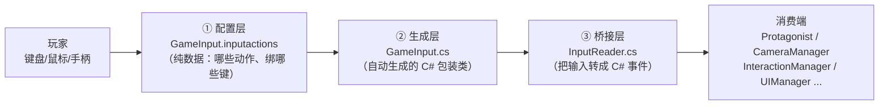

# 输入系统（Input）学习文档

> 代码位置：`Assets/Scripts/Input/`（`InputReader.cs` + 自动生成的 `GameInput.cs`）
> 配置资产：`Assets/Settings/Input/GameInput.inputactions`
> 输入读取器资产：`Assets/ScriptableObjects/Input/InputReader.asset`
> 本文档目标：**搞懂"按键 → 主角动起来"的完整链路**，并学会在 Unity 编辑器里配合调试。

---

## 目录

1. [三层架构总览](#1-三层架构总览)
2. [第一层：`.inputactions` 配置资产](#2-第一层inputactions-配置资产)
3. [第二层：`GameInput.cs` 自动生成代码](#3-第二层gameinputcs-自动生成代码)
4. [第三层：`InputReader.cs` 事件桥](#4-第三层inputreadercs-事件桥)
5. [消费端：谁在听这些事件](#5-消费端谁在听这些事件)
6. [完整链路：按一下空格发生了什么](#6-完整链路按一下空格发生了什么)
7. [除了代码还能看什么（Unity 编辑器实操）](#7-除了代码还能看什么unity-编辑器实操)
8. [按键速查表](#8-按键速查表)
9. [常见问题与调试技巧](#9-常见问题与调试技巧)

---

## 1. 三层架构总览

这个项目用的是 Unity **新版 Input System**，输入被拆成三层，各司其职：



| 层 | 文件 | 类型 | 职责 |
|----|------|------|------|
| ① 配置层 | `GameInput.inputactions` | JSON 资产 | 定义"有哪些 Action、绑定了哪些键、属于哪个 Action Map" |
| ② 生成层 | `GameInput.cs` | 自动生成代码 | 根据配置生成强类型包装类 + 回调接口 |
| ③ 桥接层 | `InputReader.cs` | ScriptableObject | **核心**：把输入事件广播成 C# 事件，任何人订阅即可 |
| 消费端 | 各种脚本 | MonoBehaviour/SO | 订阅 `InputReader` 的事件，做出反应 |

> 一句话：**改按键不改代码，改配置；加动作要改配置 + 加一行事件。**

---

## 2. 第一层：`.inputactions` 配置资产

文件：`Assets/Settings/Input/GameInput.inputactions`。这是**纯数据**（JSON），定义了三样东西：

### 2.1 Action Maps（动作组）

本项目的输入分 4 组，**同一时间只有一组启用**（用 `EnableGameplayInput()` / `EnableMenuInput()` / `EnableDialogueInput()` 切换）：

| Action Map | 用途 |
|-----------|------|
| `Gameplay` | 游玩时（移动/跳跃/攻击/交互/暂停…） |
| `Menus` | 菜单/暂停界面（确认/返回/导航…） |
| `Dialogues` | 对话时（推进对话…） |
| `Cheats` | 作弊（仅编辑器，`#if UNITY_EDITOR` 才启用） |

### 2.2 Actions（动作）

以 `Gameplay` 组为例，每个 Action 有类型和处理器：

```json
{
    "name": "Move",
    "type": "Value",                    // Value：持续值输入（摇杆/按键力度）
    "expectedControlType": "Vector2",   // 输出类型：2D 向量
    "processors": "StickDeadzone"       // 处理器：摇杆死区（防漂移）
}
```

- `Button` 类型：跳跃/攻击这种"按下/松开"的开关
- `Value` 类型：Move（Vector2）、RotateCamera（Vector2）这种连续值

### 2.3 Bindings（绑定：动作 ↔ 物理按键）

同一个 Action 可以绑多个键/多种设备（组合键用 `2DVector` 复合）：

```json
"Move" 绑定了：
  ├── 2DVector 复合键：WASD（mode=2 模拟量）
  ├── 2DVector 复合键：方向键
  └── 2DVector 复合键：手柄左摇杆
```

> 💡 查看/修改方式：**双击 `GameInput.inputactions`** 会打开 Unity 的 **Input Actions 编辑器**（可视化窗口），在这里加动作、改按键、加处理器，保存后 `GameInput.cs` 会自动重新生成。

---

## 3. 第二层：`GameInput.cs` 自动生成代码

这是 Unity 根据 `.inputactions` **自动生成**的 C# 类（**不要手改**，保存配置会重新生成）。它提供：

```csharp
public class GameInput : IInputActionCollection2, IDisposable
{
    private InputActionAsset asset;   // 运行时加载配置
    private GameplayActions m_Gameplay;   // 每个 Action Map 一个包装类
    private MenusActions m_Menus;
    private DialoguesActions m_Dialogues;
    private CheatsActions m_Cheats;

    public GameplayActions Gameplay => m_Gameplay;   // 访问入口

    // 每个 Action Map 有 Enable() / Disable() / SetCallbacks(接口)
    public class GameplayActions
    {
        public InputAction Move { get; }
        public InputAction Jump { get; }
        ...
        public void SetCallbacks(IGameplayActions instance) { ... }
    }
}

// 关键：每个 Action Map 一个回调接口
public interface IGameplayActions
{
    void OnMove(InputAction.CallbackContext context);
    void OnJump(InputAction.CallbackContext context);
    ...
}
```

**它的核心价值**：把"字符串名查 Action"变成了**强类型**（`gameInput.Gameplay.Jump`），并且提供了**回调接口**（`IGameplayActions`），让 `InputReader` 直接实现接口就能收到所有输入。

---

## 4. 第三层：`InputReader.cs` 事件桥（核心）

这是整个输入系统的**心脏**。它是一个 ScriptableObject（资产在 `ScriptableObjects/Input/InputReader.asset`），职责：**接收生成层的回调 → 转成 C# 事件 → 广播给所有订阅者**。

### 4.1 它实现了 4 个回调接口

```csharp
public class InputReader : DescriptionBaseSO,
    GameInput.IGameplayActions,      // 实现接口 = 自动收到所有输入回调
    GameInput.IDialoguesActions,
    GameInput.IMenusActions,
    GameInput.ICheatsActions
```

### 4.2 事件定义（注意初始化技巧）

```csharp
// 所有事件都用 delegate{} 初始化 → 订阅者永远不用判空
public event UnityAction JumpEvent = delegate { };
public event UnityAction JumpCanceledEvent = delegate { };
public event UnityAction<Vector2> MoveEvent = delegate { };
public event UnityAction StartedRunning = delegate { };
public event UnityAction StoppedRunning = delegate { };
...
```

> `delegate { }` 技巧：事件一开始就指向一个空方法，`Invoke()` 永远不会因为"没人订阅"而报空引用，代码里省掉所有 `if (JumpEvent != null)`。

### 4.3 启用流程（OnEnable）

```csharp
private void OnEnable()
{
    if (_gameInput == null)
    {
        _gameInput = new GameInput();            // 实例化生成的包装类
        _gameInput.Menus.SetCallbacks(this);     // 把自己注册为回调接收者
        _gameInput.Gameplay.SetCallbacks(this);
        _gameInput.Dialogues.SetCallbacks(this);
        _gameInput.Cheats.SetCallbacks(this);
    }
#if UNITY_EDITOR
    _gameInput.Cheats.Enable();                  // 作弊组仅编辑器启用
#endif
}
```

### 4.4 输入 → 事件的转换（以 Jump 为例）

```csharp
public void OnJump(InputAction.CallbackContext context)
{
    if (context.phase == InputActionPhase.Performed)   // 按下（从 0 → 非0 的瞬间）
        JumpEvent.Invoke();
    if (context.phase == InputActionPhase.Canceled)    // 松开
        JumpCanceledEvent.Invoke();
}
```

`CallbackContext.phase` 是 Input System 的核心概念：
- `Started`：按下那一下
- `Performed`：达到触发阈值（对按钮 = 按下瞬间）
- `Canceled`：松开
- `Value` 类型的 Action（如 Move）则用 `context.ReadValue<Vector2>()` 持续读取数值

### 4.5 游戏状态闸门（细节）

```csharp
public void OnInteract(InputAction.CallbackContext context)
{
    if ((context.phase == InputActionPhase.Performed)
        && (_gameStateManager.CurrentGameState == GameState.Gameplay))  // 只在游玩状态响应
        InteractEvent.Invoke();
}
```

### 4.6 输入组的切换（重要方法）

```csharp
public void EnableGameplayInput()   // 打开 Gameplay，关掉 Menus/Dialogues
public void EnableMenuInput()       // 反过来
public void EnableDialogueInput()   // 对话模式
public void DisableAllInput()       // 全关（暂停遮罩等场景用）
```

谁在切？比如打开暂停菜单时，`UIManager` 调 `EnableMenuInput()`，主角就收不到移动输入了。

---

## 5. 消费端：谁在听这些事件

`InputReader.asset` 是个全局单例式 SO，20 多个系统引用它。核心几个：

| 消费端 | 订阅的事件 | 干什么 |
|--------|-----------|--------|
| `Protagonist.cs` | `MoveEvent / JumpEvent / AttackEvent / StartedRunning…` | 把输入**缓存**到 `jumpInput` / `movementInput`，供状态机 Action 读取 |
| `CameraManager.cs` | `CameraMoveEvent / EnableMouseControlCameraEvent` | 控制第三人称摄像机 |
| `InteractionManager.cs` | `InteractEvent` | 与 NPC/物体交互 |
| `DialogueManager.cs` | `AdvanceDialogueEvent` | 推进对话 |
| `UIManager.cs` | `MenuPauseEvent / OpenInventoryEvent…` | 开关 UI |
| `SceneLoader.cs` | `SaveActionButtonEvent / ResetActionButtonEvent` | 存档/读档 |
| `MenuController / UIMenuManager…` | 菜单相关事件 | 菜单导航 |

> 订阅规范：**在 `OnEnable` 订阅、`OnDisable` 取消订阅**（`Protagonist.cs` 就是标准示范），防止重复订阅和悬挂引用。

---

## 6. 完整链路：按一下空格发生了什么

以"跳跃"为例，把三层 + 状态机串起来：

```
① 物理层：你按下 Space
      │
② 配置层：GameInput.inputactions
      │  Gameplay Map / Jump Action / Space 绑定
      ▼
③ 生成层：GameInput.cs
      │  调用回调接口 → InputReader.OnJump(context)
      │  context.phase == Performed
      ▼
④ 桥接层：InputReader.cs
      │  JumpEvent.Invoke()
      ▼
⑤ 消费端：Protagonist.cs（OnEnable 时订阅了）
      │  OnJumpInitiated() → jumpInput = true   ← 只是"记下来"
      ▼
⑥ 状态机：IsHoldingJumpCondition
      │  Statement() → _protagonistScript.jumpInput == true
      │  条件满足 → 转换到 JumpAscending
      ▼
⑦ 行为：AscendAction.OnStateEnter()
      │  给初始上冲力 → 每帧减弱的重力上升
      ▼
⑧ 应用：ApplyMovementVectorAction
      把 movementVector 写进 CharacterController → 角色真的跳起来了
```

**关键理解**：`InputReader` 只负责"转播"，`Protagonist` 只负责"记下输入值"，真正"动"是状态机的 Action 干的。输入系统和状态机通过 `jumpInput` 这个公开字段解耦。

---

## 7. 除了代码还能看什么（Unity 编辑器实操）

### ① Input Actions 编辑器（改按键首选）
双击 `Assets/Settings/Input/GameInput.inputactions` → 打开可视化窗口：
- 左侧：4 个 Action Map
- 中间：每个 Map 的 Actions 列表
- 右侧：Bindings（可以在这里改按键、加设备绑定、调处理器）

### ② Input Debugger（调试输入必开）
菜单：**Window → Analysis → Input Debugger**
- 实时查看当前按下的键、每个 Action 的状态（phase）
- 手柄连不上时在这里看设备有没有被识别
- 能直接看到 `Gameplay/Jump` 现在的 phase 是什么 → 排查"为什么没触发"

### ③ 找 InputReader 被谁引用
在 Project 窗口选中 `ScriptableObjects/Input/InputReader.asset`，看 Inspector 下方或被引用情况；或用搜索功能搜 `InputReader`（本项目的消费端列表见第 5 节）。

### ④ 检查 Active Input Handling
菜单：**Edit → Project Settings → Player → Other Settings → Active Input Handling**
确认是 **Input System Package (New)** 或 **Both**，否则新版 Input System 不会生效。

### ⑤ 运行时验证整条链路
在 Play 模式下：
1. 打开 Input Debugger 看 `Gameplay/Jump` 是否变 `Performed`
2. 打开 `StateMachineDebugger` 看角色是否从 Idle 切到 JumpAscending
3. 如果 1 有、2 没有 → 问题在状态机配置；如果 1 都没有 → 问题在输入系统

---

## 8. 按键速查表（Gameplay 组）

| 操作 | 按键 | Action 类型 |
|------|------|-------------|
| 移动 | WASD / 方向键 / 手柄左摇杆 | Value(Vector2) + StickDeadzone |
| 跳跃 | Space | Button |
| 攻击 | F / 鼠标左键 | Button |
| 交互（对话/拾取） | E | Button（仅 Gameplay 状态） |
| 暂停 | Esc | Button |
| 打开背包 | Tab | Button |
| 转动镜头 | 移动鼠标（delta×2）/ IJKL（×8） | Value(Vector2) |
| 鼠标控制镜头 | 按住鼠标右键 | Button |
| 奔跑 | Shift / 右 Shift | Button |

> 完整的 4 个 Map 的按键都在 `GameInput.inputactions` 里，用第 7 节的 Input Actions 编辑器看最直观。改成什么键都不需要动代码。

---

## 9. 常见问题与调试技巧

| 现象 | 排查思路 |
|------|---------|
| 按键没反应 | ① Input Debugger 看 Action 有没有变 Performed ② 检查是否 `EnableGameplayInput()` 被调用了（比如暂停没恢复） |
| 手柄/新设备不识别 | Input Debugger → Devices 里看设备；检查绑定分组的 `KeyboardOrGamepad` |
| 改了按键不生效 | 保存 `.inputactions` 后确认 `GameInput.cs` 重新生成了（Unity 自动处理），重启编辑器 |
| 摇杆漂移/不动 | 看 Move 的 `StickDeadzone` 处理器是否在（配置层被误删） |
| 想加新按键动作 | ① Input Actions 窗口加 Action + 绑定 ② `GameInput` 重新生成 ③ `InputReader` 加事件 + 实现对应 `OnXxx` 回调 ④ 消费端订阅 |
| 收到重复输入 | 检查消费端是否在 `OnDisable` 取消订阅（这个项目所有脚本都遵守"OnEnable 订阅/OnDisable 退订"） |

---

*核心心法：这个输入系统是"配置驱动 + 事件广播"——想改键去 `.inputactions`，想加动作去 `InputReader` 加一行事件，想监听就订阅事件。整个链路里 `InputReader` 是唯一入口，读懂它就读懂了输入。*
