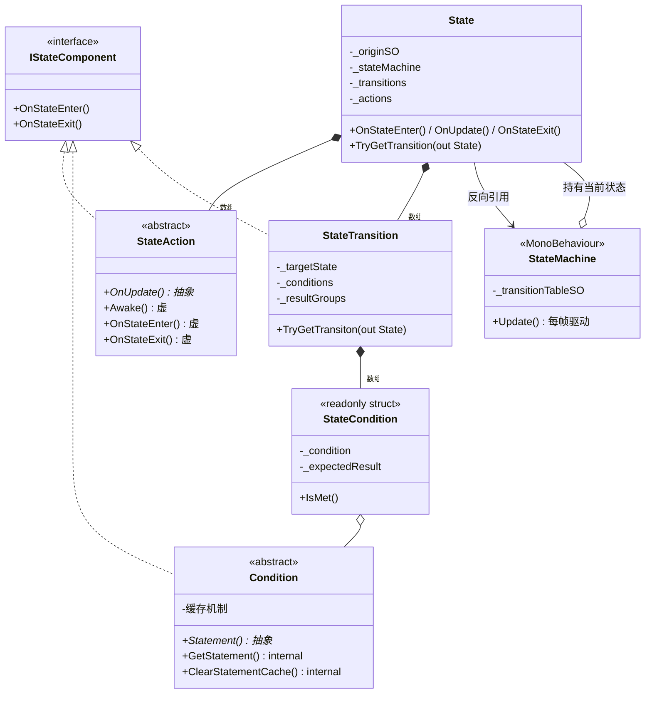

# 状态机框架 Core 详解（UOP1.StateMachine）

> 代码位置：`Assets/Scripts/StateMachine/Core/`
> 配套数据层：`Assets/Scripts/StateMachine/ScriptableObjects/`
> 角色行为层：`Assets/Scripts/Characters/StateMachine/`（Actions + Conditions）
> 数据资产：`Assets/ScriptableObjects/StateMachine/Protagonist/`（主角）、`NPCs/`、`Critters/`
> 本文档定位：**框架原理速查手册**，每个类都配一个项目里的具体实现例子。

---

## 目录

1. [一句话概括](#1-一句话概括)
2. [类关系总览](#2-类关系总览)
3. [Core 六个类逐个讲](#3-core-六个类逐个讲)
4. [数据层如何变成运行时对象（工厂模式）](#4-数据层如何变成运行时对象工厂模式)
5. [完整运行时流程](#5-完整运行时流程)
6. [用到的设计模式总结](#6-用到的设计模式总结)
7. [学习索引：从哪找具体实现](#7-学习索引从哪找具体实现)

---

## 1. 一句话概括

**Core 是一个"通用、数据驱动、可热配置"的状态机框架**：代码只负责"怎么跑"，`.asset` 资产负责"跑什么"。主角、NPC、小怪全部共用这一套框架，区别只在注入的数据资产不同。

核心思想三句话：
- **状态（State）= 一组行为（Actions）+ 一组出口（Transitions）**
- **行为（StateAction）**：进入/每帧/退出时做什么（由 SO 资产里的 Action 列表决定）
- **转换（StateTransition）**：满足什么条件就跳去哪个状态（由 SO 资产里的转换表决定）

---

## 2. 类关系总览



---

## 3. Core 六个类逐个讲

### 3.1 `IStateComponent` —— 统一生命周期接口

```csharp
interface IStateComponent
{
    void OnStateEnter();   // 进入状态时
    void OnStateExit();    // 退出状态时
}
```

**作用**：让三种完全不同的对象（行为、条件、转换）拥有**相同的生命周期入口**，这样 `State` 才能用一段通用代码统一通知它们"我进来了 / 我出去了"。

**具体实现例子**（谁实现了它）：
- `StateAction`（每个行为：如 `AscendAction` 的 `OnStateEnter` 里设置初始跳跃力）
- `Condition`（如 `TimeElapsedCondition` 的 `OnStateEnter` 里记录 `_startTime`，开始计时）
- `StateTransition`（转发给内部所有条件的生命周期）

---

### 3.2 `StateAction` —— "状态里做什么"（行为抽象基类）

```csharp
public abstract class StateAction : IStateComponent
{
    internal StateActionSO _originSO;             // 我来自哪个 SO 模板
    protected StateActionSO OriginSO => _originSO; // 子类访问 SO 数据的通道

    public abstract void OnUpdate();              // 抽象：每帧必做（必须实现）
    public virtual void Awake(StateMachine stateMachine) { }  // 虚：缓存组件引用
    public virtual void OnStateEnter() { }        // 虚：进入时
    public virtual void OnStateExit() { }         // 虚：退出时
}
```

**设计要点**：
- `OnUpdate()` 是**抽象**的 → 每个行为必须定义"每帧做什么"
- `Awake / OnStateEnter / OnStateExit` 是**虚**的 → 有空的默认实现，不需要就不重写

**具体实现例子**（`Assets/Scripts/Characters/StateMachine/Actions/AscendActionSO.cs`）：

```csharp
[CreateAssetMenu(fileName = "Ascend", menuName = "State Machines/Actions/Ascend")]
public class AscendActionSO : StateActionSO<AscendAction>
{
    public float initialJumpForce = 6f;   // ← SO 里配置的数据（在 .asset 里可调）
}

public class AscendAction : StateAction
{
    private Protagonist _protagonistScript;
    private AscendActionSO _originSO => (AscendActionSO)base.OriginSO;

    public override void Awake(StateMachine stateMachine)   // 缓存组件
    {
        _protagonistScript = stateMachine.GetComponent<Protagonist>();
    }

    public override void OnStateEnter()                     // 进入上升状态：给初始冲力
    {
        _verticalMovement = _originSO.initialJumpForce;
    }

    public override void OnUpdate()                         // 每帧：减弱的重力
    {
        _gravityContributionMultiplier += Protagonist.GRAVITY_COMEBACK_MULTIPLIER;
        _gravityContributionMultiplier *= Protagonist.GRAVITY_DIVIDER;
        _verticalMovement += Physics.gravity.y * Protagonist.GRAVITY_MULTIPLIER
                             * _gravityContributionMultiplier * Time.deltaTime;
        _protagonistScript.movementVector.y = _verticalMovement;
    }
}
```

> 其他例子：`HorizontalMoveActionSO`（水平移动）、`ApplyMovementVectorActionSO`（把向量写进 CharacterController）、`GroundGravityActionSO`（贴地重力）、`RotateActionSO`（转向）。

---

### 3.3 `Condition` + `StateCondition` —— "条件满足了吗"

这个文件里其实是**一对**：可变的条件对象 + 不可变的打包结构。

#### `Condition`（抽象类，运行时条件对象，带缓存）

```csharp
public abstract class Condition : IStateComponent
{
    private bool _isCached;         // 这帧算过了吗
    private bool _cachedStatement;  // 缓存的结果
    internal StateConditionSO _originSO;

    protected abstract bool Statement();   // 抽象：子类实现"具体判断"

    internal bool GetStatement()           // 带缓存的入口
    {
        if (!_isCached) { _isCached = true; _cachedStatement = Statement(); }
        return _cachedStatement;
    }
    internal void ClearStatementCache() => _isCached = false;  // 帧末清缓存
}
```

**缓存机制的意义**：同一帧里 `IsGrounded` 可能被多个转换同时询问，缓存保证**同一帧内只算一次、结果恒定**（避免重复计算和不一致）。

**具体实现例子**（`Conditions/IsHoldingJumpConditionSO.cs`）：

```csharp
public class IsHoldingJumpCondition : Condition
{
    private Protagonist _protagonistScript;
    public override void Awake(StateMachine stateMachine)
    {
        _protagonistScript = stateMachine.GetComponent<Protagonist>();
    }
    protected override bool Statement() => _protagonistScript.jumpInput;  // 就这一行核心逻辑
}
```

另一个例子 `TimeElapsedCondition`（计时器条件，用于 `Timer_JumpHoldButton.asset`，`timerLength=0.4`）：

```csharp
public class TimeElapsedCondition : Condition
{
    private float _startTime;
    public override void OnStateEnter() { _startTime = Time.time; }   // 进状态开始计时
    protected override bool Statement() => Time.time >= _startTime + _originSO.timerLength;
}
```

#### `StateCondition`（readonly struct，条件"打包 + 期望结果"）

```csharp
public readonly struct StateCondition
{
    internal readonly StateMachine _stateMachine;
    internal readonly Condition _condition;      // 指向活的条件
    internal readonly bool _expectedResult;      // 期望结果（True/False）

    public bool IsMet()
    {
        bool statement = _condition.GetStatement();  // 问"活的条件"现在真假
        bool isMet = statement == _expectedResult;   // 和期望比对
        return isMet;
    }
}
```

**为什么是 readonly struct**：这是转换表构建时一次性生成的"条件绑定包"，之后只读不写。用值类型避免堆分配，用 readonly 防止构建后被篡改。

**具体例子**：转换表里 `IsGrounded` 条件可能被配置成 `ExpectedResult = True`（用于"落地了"的转换），也可能被配置成 `False`（用于"还在空中"的转换）——同一个 `Condition` 对象，被不同的 `StateCondition` 包上不同的期望值，这就是 `_expectedResult` 存在的意义。

---

### 3.4 `StateTransition` —— "状态之间的桥"（带条件）

```csharp
public class StateTransition : IStateComponent
{
    private State _targetState;      // 目标状态
    private StateCondition[] _conditions;  // 条件数组
    private int[] _resultGroups;     // 分组信息：组内 AND，组间 OR

    public bool TryGetTransiton(out State state)
    {
        state = ShouldTransition() ? _targetState : null;
        return state != null;
    }

    private bool ShouldTransition()
    {
        // 组内：条件逐个 AND
        // 组间：结果逐个 OR
        // 例如 [A AND B] OR [C AND D]
    }
}
```

**`_resultGroups` 的分组逻辑**（来自 `TransitionTableSO.ProcessConditionUsages`）：
- 条件之间用 `Operator.And` 连接的会**合并进同一组**
- `Operator.Or` 会**开启新组**
- 求值：组内全部满足（AND）→ 该组为真；任意一组为真（OR）→ 整体满足

**具体实现例子**：主角 `JumpAscending → JumpDescending` 的转换，配置了 3 个条件（3 组）：
```
Timer_JumpHoldButton == True（0.4s 到了 = 上限）
OR  IsHoldingJump == False（松手了）
OR  HasHitHead == True（撞头）
```
三个条件任一满足 → 从上升转入下落。这就是"按住跳更高、但有 0.4 秒上限"的机制。

---

### 3.5 `State` —— 一个运行时状态（行为 + 出口）

```csharp
public class State
{
    internal StateSO _originSO;          // 出生证明（调试用）
    internal StateMachine _stateMachine; // 反向引用（拿组件用）
    internal StateTransition[] _transitions;  // 出口清单
    internal StateAction[] _actions;          // 待办事项

    public void OnStateEnter() { /* 通知所有 transitions 和 actions */ }
    public void OnUpdate()     { /* 每帧执行所有 actions */ }
    public void OnStateExit()  { /* 通知所有 transitions 和 actions */ }

    public bool TryGetTransition(out State state)
    {
        // ① 按顺序检查每条转换，第一条满足的"定案"
        // ② 清掉所有条件缓存（下帧重新算）
        // ③ 返回：有目标状态 → true + out 传出目标
    }
}
```

**具体例子**：主角的 `JumpAscending` 状态，其 `.asset` 资产里配置了：
- Actions：`AscendAction`、`RotateAction`、`ApplyMovementVectorAction`、`AnimatorParameterAction` 等
- Transitions：`→ JumpAscendingAttacking`（按攻击）、`→ JumpDescending`（松手/超时/撞头）等

`State` 自己不判断任何逻辑，它只是**容器 + 调度器**：进入时通知所有子组件，每帧执行所有行为，然后问每条转换"条件满足了吗"。

---

### 3.6 `StateMachine` —— 挂在角色身上的驱动器（唯一入口）

```csharp
public class StateMachine : MonoBehaviour
{
    [SerializeField] private TransitionTableSO _transitionTableSO;  // 图纸（.asset）

    private void Awake()
    {
        _currentState = _transitionTableSO.GetInitialState(this);  // 按图纸实例化
    }

    private void Start() { _currentState.OnStateEnter(); }  // 进入初始状态

    private void Update()
    {
        // 状态机核心三行：
        if (_currentState.TryGetTransition(out var transitionState))
            Transition(transitionState);       // 有出口满足 → 切状态
        _currentState.OnUpdate();              // 没有 → 继续执行当前行为
    }

    private void Transition(State transitionState)
    {
        _currentState.OnStateExit();   // 通知旧状态所有子组件退出
        _currentState = transitionState;
        _currentState.OnStateEnter();  // 通知新状态所有子组件进入
    }
}
```

**它还是"组件缓存池"**：
```csharp
public new bool TryGetComponent<T>(out T component)  // 缓存，避免重复 GetComponent
public T GetOrAddComponent<T>()                       // 没有就加
public new T GetComponent<T>()                        // 找不到直接抛异常
```
所有 Action/Condition 都是通过 `stateMachine.GetComponent<Protagonist>()` 等拿组件，走的就是这个缓存。

**具体例子**：`Prefabs/Characters/PigChef.prefab` 根节点上挂了 `StateMachine` 组件，Inspector 里把 `_transitionTableSO` 指向 `ScriptableObjects/StateMachine/Protagonist/PigChef_TransitionTable.asset`。NPC 的 `NPC.prefab`、小怪的预制体同理，各自指向自己的转换表。

---

## 4. 数据层如何变成运行时对象（工厂模式）

`.asset`（ScriptableObject 模板）→ 运行时对象（State/Action/Condition）的转换靠的是 **SO 层的工厂方法** + **`createdInstances` 字典去重**：

```
TransitionTableSO.GetInitialState()
   │  遍历每条转换，按 FromState 分组
   │
   ├─ StateSO.GetState(stateMachine, createdInstances)
   │     │  ① 查字典：这个 StateSO 已经实例化过了吗？
   │     │     有 → 直接复用（享元/单例式）
   │     │     无 → new State()，填入 _actions / _originSO / _stateMachine
   │     └─ StateActionSO<T>.CreateAction() → new T()  （工厂方法）
   │           └─ action.Awake(stateMachine)  （缓存组件）
   │
   └─ StateConditionSO<T>.CreateCondition() → new T()
         └─ 包成 readonly StateCondition（带上 expectedResult）
```

**`createdInstances` 字典为什么重要**：
- **同一个 StateSO 资产**在转换表里可能被多个转换引用（比如 `Idle` 状态被 10 条转换指向）→ 运行时**只实例化一次**，大家共享同一个 `State` 对象
- 同一个 `ConditionSO` 同理 → 所以条件对象是**共享的**，这正解释了为什么需要"每帧缓存结果 + 帧末清缓存"

---

## 5. 完整运行时流程

以主角 PigChef 为例，从 Play 到"跳起来"：

```
① Awake（Prefab 实例化）
   StateMachine._currentState = TransitionTableSO.GetInitialState()
      → 按 PigChef_TransitionTable.asset 递归实例化所有 State / Action / Condition

② Start
   _currentState.OnStateEnter()   → Idle 状态的所有 Actions 和 Transitions 收到"进入"

③ Update（每帧，以 JumpAscending 为例）
   a. TryGetTransition？
        → 检查所有出口：JumpAscendingAttacking / JumpDescending ...
        → 例如"IsHoldingJump == False"（你松手了）→ 转换到 JumpDescending
   b. 有转换 → 旧状态 OnStateExit()（如 DescendAction 清 jumpInput 防二段跳）
              → 新状态 OnStateEnter()（如重新计时）
   c. 没转换 → 当前状态所有 Actions 执行 OnUpdate()
        → AscendAction 用减弱的重力继续上升
        → ApplyMovementVectorAction 把 movementVector 写进 CharacterController
```

---

## 6. 用到的设计模式总结

| 设计模式 | 在框架哪里 | 好处 |
|----------|-----------|------|
| **状态模式** | State / StateTransition / StateMachine | 把每个状态的行为封装成独立对象，增删状态不改核心代码 |
| **模板方法模式** | StateAction / Condition 的虚方法 + 抽象方法 | 框架定"何时调用"，子类定"具体做什么" |
| **工厂方法模式** | `StateActionSO<T>.CreateAction()`、`StateConditionSO<T>.CreateCondition()` | SO 资产通过泛型模板自动 new 出对应运行时类 |
| **享元模式（对象复用）** | `createdInstances` 字典 | 同一 SO 资产只实例化一次，多转换共享 |
| **缓存模式** | Condition 的 `_isCached/_cachedStatement` | 同一帧条件只算一次，结果稳定 |
| **Try 模式** | `TryGetTransition(out State)` | bool 表示"成没成"，out 表示"成了去哪" |
| **事件驱动解耦** | 状态机与外部通过组件缓存交互 | Action/Condition 不直接依赖角色类，只依赖 `StateMachine` |

---

## 7. 学习索引：从哪找具体实现

| 想理解 | 看哪个具体实现 |
|--------|---------------|
| Action 怎么写 | `Actions/AscendActionSO.cs`（跳跃上升）、`Actions/HorizontalMoveActionSO.cs`（水平移动）、`Actions/RotateActionSO.cs`（转向） |
| Condition 怎么写 | `Conditions/IsHoldingJumpConditionSO.cs`（读 jumpInput）、`Conditions/TimeElapsedConditionSO.cs`（计时器）、`Conditions/IsGroundedConditionSO.cs`（落地检测） |
| 状态机怎么拼 | `ScriptableObjects/StateMachine/Protagonist/PigChef_TransitionTable.asset` + 对应 `States/`、`Conditions/`、`Actions/` 下的 `.asset` |
| 跳跃全链路 | `JumpAscending` 状态 → `AscendAction` + `IsHoldingJump` + `Timer_JumpHoldButton` |
| NPC 怎么用同一框架 | `ScriptableObjects/StateMachine/NPCs/`（含 `Shared/` 公共配置）+ `NPC.cs` + NPC 专用 Action（`NPCMoveToNextDestinationSO`、`StopAgentSO`） |
| 调试器 | 编辑器里运行 → `Window` 打开 `StateMachineDebugger`，实时看状态/条件求值 |

---

*核心心法：Core 这 6 个文件是"发动机"，理解它们的调用顺序（Enter → 每帧 Update/检查转换 → Exit）就够了；剩下的全是"往发动机里塞什么数据"的问题。*
